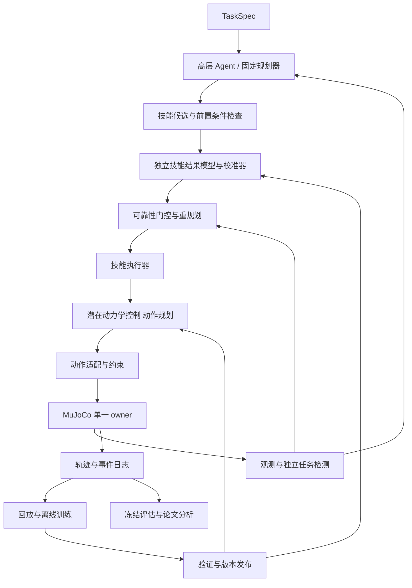
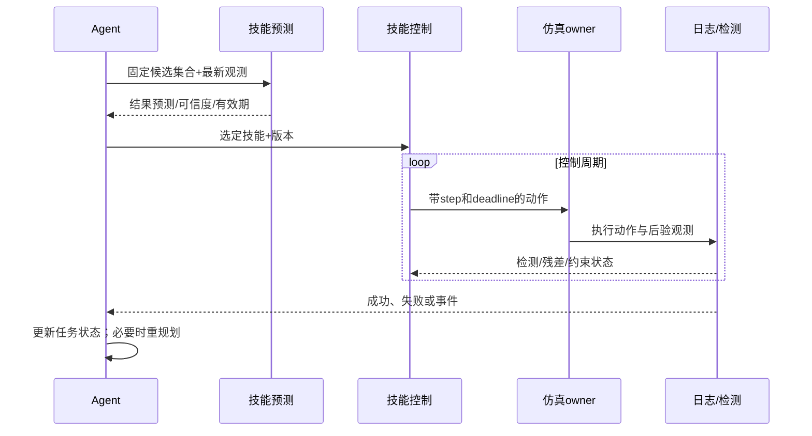
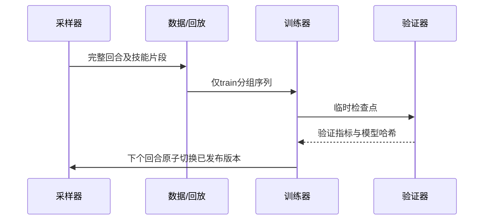

# 架构与时序

| 模块 | 输入→输出 | 职责与边界 |
|---|---|---|
| agents | TaskSpec/Feedback→技能候选 | 低频规划；不访问物理积分器 |
| models | 状态/动作或技能→潜在/结果预测 | 区分低层控制模型与技能结果模型 |
| planners | 候选/PredictionReport→选择或重规划 | 门控不等于安全证明 |
| skills | SkillSpec→ActionCommand | 超时、终止及恢复次数管理 |
| envs/robots | ActionCommand→Observation | 唯一状态修改入口；坐标与控制模式适配 |
| communication | 消息→确认/错误 | 版本、时序和 episode 隔离 |
| datasets/replay/training | 仿真轨迹→检查点 | 数据来源及训练集边界 |
| evaluation/logging/analysis | 冻结快照→指标及图表 | 独立检测器与可追溯证据 |

完整例子：任务要求将被遮挡物体放入容器。Agent 提出直接抓取或先移开遮挡物；前置条件检查与结果预测共同筛选。若直接抓取预测不可信，则选择移开遮挡物；执行器用对应技能嵌入驱动 MPC，MuJoCo 回传结果。物体受扰动移动时，实际残差触发重新观测和候选评估。只有独立的“物体在容器内且保持稳定”检测器确认才完成。此例是设计行为，不是实验结果。

删除高层预测反馈后，低层 潜在动力学控制 仍可保留；丢失的是执行前比较候选结果及基于预测偏差触发重规划的能力。用候选排序准确率、无效尝试数、恢复成功率和整任务成功率量化，而非只看语言计划。
