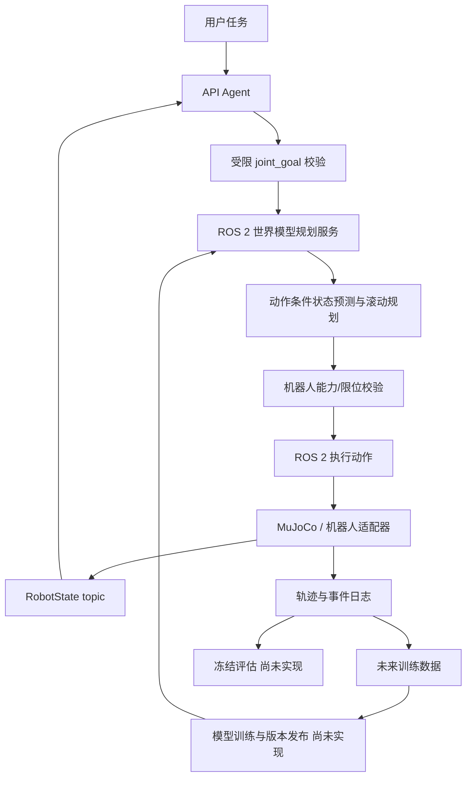
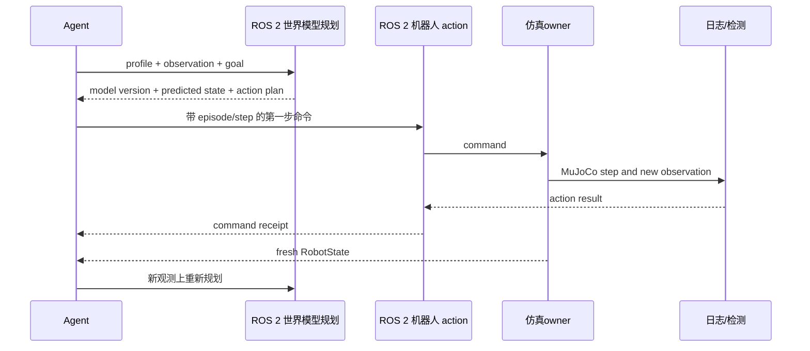
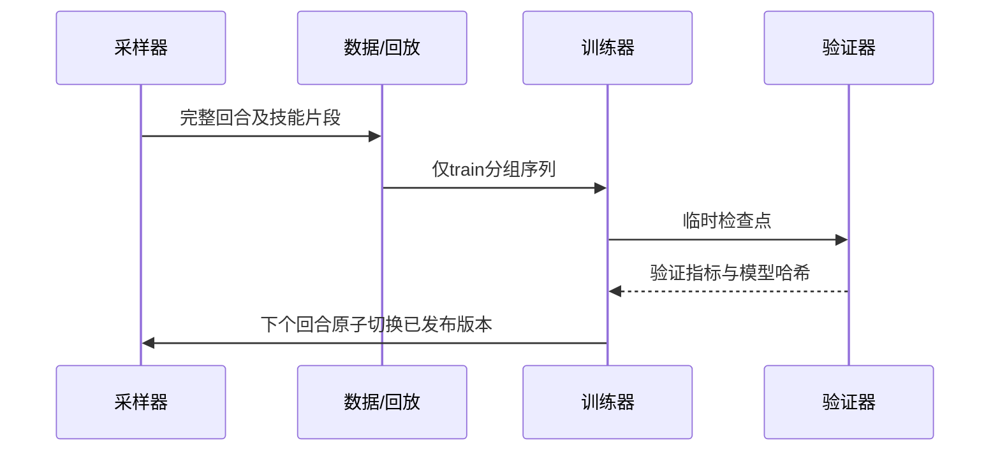

# 架构与时序

| 模块 | 输入→输出 | 职责与边界 |
|---|---|---|
| agents | 指令/Observation→受限 joint_goal | 调用 HTTP API；不访问物理积分器 |
| models | 状态与动作候选→未来状态预测 | DynamicsModel 插件接口；当前无已训练模型 |
| planners | Goal/Observation→PredictionReport 与首个动作 | 滚动规划；不代表安全证明 |
| skills | SkillSpec→ActionCommand | 技能库预留；尚未接入当前 joint_goal 路径 |
| envs/robots | ActionCommand→Observation | 唯一状态修改入口；坐标与控制模式适配 |
| communication | 消息→确认/错误 | 版本、时序和 episode 隔离 |
| datasets/replay/training | 仿真轨迹→检查点 | 数据来源及训练集边界 |
| evaluation/logging/analysis | 冻结快照→指标及图表 | 独立检测器与可追溯证据 |

当前可运行例子只覆盖 joint_goal：Agent 得到关节目标后，请 planner 依据 Observation 和世界模型插件评估目标动作候选；执行首个命令，机器人节点在 MuJoCo owner 中步进并发布新观测；Agent 确认实际关节误差后结束，或再次规划。物体、夹爪或自然语言任务完成判定尚未实现。

若删除 planner 的动作条件预测，可比较固定目标动作与模型选出的动作，在相同关节初态下测量收敛步数、跟踪误差和模型查询延迟。当前 API Agent 只产生 joint_goal，无法衡量物体级任务恢复能力。
