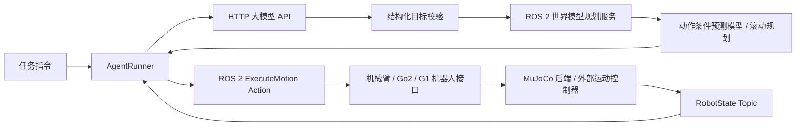

# Agent、世界模型规划器与 ROS 2 实现设计

本设计替代早期文档中以技能结果筛选为主的运行主线。场景未确定，先提供机器人能力描述、目标解析、世界模型规划调用和动作执行闭环。文件按职责命名，不绑定论文算法。

## 数据流



大模型负责把文本转为目标，不返回可直接执行的 Python，也不自行判定机器人任务成功。当前内置目标为 joint_goal（指定命名关节的目标），是与场景解耦的最小执行能力。另有显式 `--mode wma-policy` 路径：ROS 机器人节点可发布配置相机的 RGB+同一步 Observation，Agent 把有界历史送至外部 `/predict_action` 服务，只执行 action chunk 第一步，再等新图像/状态。策略服务与 G1 数据集动作语义尚未闭环验证。

世界模型位于规划路径：输入观测、关节目标和机器人约束；输出绑定观测 episode/step 的动作计划。内置 RolloutPlanner 调用独立注入的 DynamicsModel.predict，搜索动作候选并只执行首个动作，然后重新观测与规划。项目现提供可从 MuJoCo 采样训练的低维关节状态基线，正式机器人任务模型仍需训练；也支持 module:factory 插件接入，接口包括模型版本。

## 模块

| 位置 | 职责 |
|---|---|
| agents/api_client.py | OpenAI-compatible Chat Completions HTTP 协议，超时、结构化 JSON 解析、错误去敏 |
| agents/runner.py | 获取新观测、调用大模型、调用规划器、执行首个动作、验证误差、有限步数退出 |
| communication/contracts.py | RobotProfile、Observation、Goal、MotionCommand、Plan、ExecutionResult 及 JSON 校验 |
| communication/ros2_transport.py | 后台 executor、状态/可选同步 RGB 订阅、规划 service client、机器人 action client 与取消 |
| robots/interfaces.py | ArmInterface、Go2Interface、G1Interface；检查机器人身份、关节限位与能力 |
| planners/world_planner.py | 动作条件世界模型协议与可替换 rollout 规划器 |
| envs/mujoco_backend.py | 命名关节到执行器映射、物理步进、关节观测、位置或 PD 力矩控制 |
| communication/ros2_nodes.py | MuJoCo 状态/执行 action server、世界模型规划 service server |
| logging/events.py | JSONL 任务、规划和执行事件 |
| ros2/wmal_interfaces | 自定义消息、规划服务、可取消执行 action；使用 colcon 构建 |

## ROS 2 契约

每个机器人使用独立命名空间 `/wmal/<robot_id>`：

- `state`：RobotState，JSON 负载附 schema_version；QoS reliable、depth 1。
- `execute_motion`：ExecuteMotion action，包含目标受理、进行中反馈、终态、取消。
- `/wmal/plan`：PlanMotion service，机器人 profile + 最新观测 + goal → plan 或结构化错误。
- `/wmal/<robot_id>/reset`：ResetSimulation service，仅机器人空闲时重置场景，返回新的 episode_id 和初始观测。

JSON 用于初期可演化的研究字段；每条入口重新校验，不依赖语言模型保证格式。命令必须带 robot_id、episode_id、expected_step、唯一 command_id、有限 duration_s。持续时间是相对时长；不跨机器传递单调时钟 deadline。过期状态由接收端按本地接收时间判定，旧 episode、旧 step 和重复 command_id 在机器人端拒绝。

物理仿真由后端拥有，timer 调用 step；动作回调设置受限目标并等待实际关节误差满足容差。action 结束不等同于整个任务成功。Agent 以新观测重新计算目标误差。超时取消后停止本次流程，不自动重发物理动作。服务推理无自动重试；下一次规划必须显式刷新观测。

## 机器人接口边界

三个机器人接口都支持命名关节位置命令；关节清单、限位和执行器模式来自用户提供的模型配置，不把固定自由度写死。Go2/G1 额外定义 body velocity 命令接口，但仅在显式加载 locomotion controller 插件后开放；插件需实现 set_velocity、step、stop。通用 PD 能验证关节通信，不证明浮基机器人站立、平衡或行走成功。

机械臂末端 IK、夹爪语义、Go2 步态以及真机 G1 控制仍需对应控制器；本地浮基 G1 另有一个独立的 Unitree 预训练策略 MuJoCo 回放入口，见 [G1 本地步行指南](16_g1_local_walking.md)。它不等于 ROS locomotion 插件或真机接口。MuJoCo XML 和 mesh 由配置指定，不能假设官方真机 lowcmd 可直接控制 MuJoCo。Unitree 真机接口属于后续独立适配。步态插件每次调用只写 actuator target；物理积分由 MuJoCo owner 唯一执行。

## 验证与运行边界

本地 G1 固定底座模型位于 `robots/assets/unitree_g1/g1_29dof_fixed_base.xml`，配置为 `configs/robots/g1_fixed_base.json`，包含 29 个关节限位、PD 力矩电机映射和 `pack_camera` RGB 渲染相机。该相机是世界坐标下的观察视角，并非已标定的数据集相机外参。运行 `python scripts/simulate.py --config configs/robots/g1_fixed_base.json --viewer` 后，可按 `N`/`P` 选关节、`[`/`]` 调整当前目标（每次 0.1 rad）、`0` 保持当前位置；该配置固定 pelvis，不支持 locomotion，也没有可动手指/夹爪。独立的浮基行走命令为 `PYTHONPATH=src python scripts/walk_g1.py --steps 10`，使用上游匹配模型和预训练 ONNX 策略，并通过实际足部触地事件计数与跌倒保护。该本地仿真不验证真机控制或 WMA 数据集动作映射；后者仍需核对数据集 state/action 次序、单位、归一化和外部策略 endpoint。

ROS action/service 的端到端构建与通信验证须在已安装 ROS 2 的 Ubuntu 环境执行。测试用动态模型不能当论文世界模型结果，未配置 API 凭据不得声称真实大模型已调用。

G1 固定底座关节控制/渲染和浮基策略回放均在本地 `wmal` Conda 环境的 MuJoCo 上验证；浮基回放 10 个触地步后约前进 0.60 m，姿态/高度保护通过。`rclpy`/`colcon` 端到端通信尚未验证；ROS 2 节点在 Ubuntu 24.04 + Jazzy 路径需另行构建检查。

官方接口参考（2026-09-22 查阅）：
- https://docs.ros.org/en/jazzy/p/rclpy/api/actions.html
- https://docs.ros.org/en/ros2_documentation/kilted/How-To-Guides/Using-callback-groups.html
- https://mujoco.readthedocs.io/en/latest/programming/simulation.html
- https://github.com/unitreerobotics/unitree_ros2

## Ubuntu 24.04 / ROS 2 Jazzy 安装与启动

在目标系统按 ROS 官方文档安装 ros-base、colcon 和接口生成工具。ROS Python 绑定需对运行环境可见；在 source `/opt/ros/jazzy/setup.bash` 后，用系统 Python 建立 `--system-site-packages` 虚拟环境，再安装项目。训练用深度学习框架另行按 GPU 驱动选取和锁定。

```bash
source /opt/ros/jazzy/setup.bash
python3 -m venv --system-site-packages .venv
source .venv/bin/activate
python -m pip install -e '.[simulation]'
cd ros2
colcon build --base-paths wmal_interfaces
source install/setup.bash
cd ..
```

在三个终端分别启动：

```bash
# 终端 A：单关节探针，只验证 ROS 与 MuJoCo 接口
source /opt/ros/jazzy/setup.bash && source .venv/bin/activate
PYTHONPATH=src python scripts/serve_ros2.py robot --config configs/robots/interface_probe.json

# 终端 B：加载本项目训练的探针模型；实际任务可用 --plugin 接入其他规划器
source /opt/ros/jazzy/setup.bash && source .venv/bin/activate
PYTHONPATH=src python scripts/serve_ros2.py planner --checkpoint runs/probe/model.json

# 终端 C：大模型 API Agent
source /opt/ros/jazzy/setup.bash && source .venv/bin/activate
export LLM_BASE_URL='https://provider.example/v1'
export LLM_MODEL='your-model'
read -s LLM_API_KEY && export LLM_API_KEY
PYTHONPATH=src python scripts/run_agent.py --config configs/robots/interface_probe.json --instruction 'set hinge to 0.3 radians'
```

`provider.example` 只是格式示例；API key 只从环境读取，不写入配置文件。先按[规划主线](11_planning_world_model_pipeline.md)采样并训练 `runs/probe/model.json`。若使用 `--plugin`，factory 直接返回具有 `plan(profile, observation, goal)` 的规划器。未启动终端 B 时 Agent 会报 planner unavailable。

Go2 仍需要真实 MuJoCo XML、完整关节限位和 actuator 映射。探针 XML 不是研究机械臂资产。G1 固定底座配置用于关节级仿真；另外 `scripts/walk_g1.py` 可独立回放已发布的 G1 速度策略。二者均不自动开放 ROS 中的浮基 `base_velocity` 能力，该能力仍要求 profile 与 ROS locomotion 插件配置齐备。
