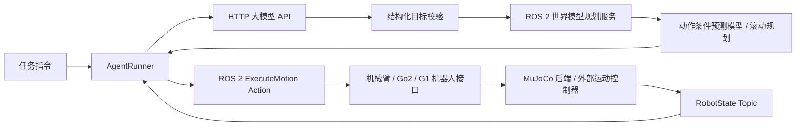

# Agent、世界模型规划器与 ROS 2 实现设计

本设计替代早期文档中以技能结果筛选为主的运行主线。场景未确定，先提供机器人能力描述、目标解析、世界模型规划调用和动作执行闭环。文件按职责命名，不绑定论文算法。

## 数据流

大模型负责把文本转为目标，不返回可直接执行的 Python，也不自行判定机器人任务成功。当前内置目标为 joint_goal（指定命名关节的目标），是与场景解耦的最小执行能力。未来场景目标通过新的目标解析器及规划插件扩展，不把任意自然语言理解能力当成已完成。

世界模型位于规划路径：输入观测、关节目标和机器人约束；输出绑定观测 episode/step 的动作计划。内置 RolloutPlanner 调用独立注入的 DynamicsModel.predict，搜索动作候选并只执行首个动作，然后重新观测与规划。项目不提供预训练世界模型；离线演示使用明确标记的确定性测试模型。真实模型以 module:factory 插件接入，接口包括模型版本。

## 模块

| 位置 | 职责 |
|---|---|
| agents/api_client.py | OpenAI-compatible Chat Completions HTTP 协议，超时、结构化 JSON 解析、错误去敏 |
| agents/runner.py | 获取新观测、调用大模型、调用规划器、执行首个动作、验证误差、有限步数退出 |
| communication/contracts.py | RobotProfile、Observation、Goal、MotionCommand、Plan、ExecutionResult 及 JSON 校验 |
| communication/ros2_transport.py | 后台 executor、状态订阅、规划 service client、机器人 action client 与取消 |
| robots/interfaces.py | ArmInterface、Go2Interface、G1Interface；检查机器人身份、关节限位与能力 |
| planners/world_planner.py | 动作条件世界模型协议与可替换 rollout 规划器 |
| envs/mujoco_backend.py | 命名关节到执行器映射、物理步进、关节观测、位置或 PD 力矩控制 |
| communication/ros2_nodes.py | MuJoCo 状态/执行 action server、世界模型规划 service server |
| logging/events.py | JSONL 任务、规划和执行事件 |
| ros2/wmal_interfaces | 自定义消息、规划服务、可取消执行 action；使用 colcon 构建 |

## ROS 2 契约

每个机器人使用独立命名空间 `/wmal/<robot_id>`：

- `state`：RobotState，JSON 负载附 schema_version；QoS reliable、depth 1。
- `execute_motion`：ExecuteMotion action，包含目标受理、进行中反馈、终态、取消。
- `/wmal/plan`：PlanMotion service，机器人 profile + 最新观测 + goal → plan 或结构化错误。

JSON 用于初期可演化的研究字段；每条入口重新校验，不依赖语言模型保证格式。命令必须带 robot_id、episode_id、expected_step、唯一 command_id、有限 duration_s。持续时间是相对时长；不跨机器传递单调时钟 deadline。过期状态由接收端按本地接收时间判定，旧 episode、旧 step 和重复 command_id 在机器人端拒绝。

物理仿真由后端拥有，timer 调用 step；动作回调设置受限目标并等待实际关节误差满足容差。action 结束不等同于整个任务成功。Agent 以新观测重新计算目标误差。超时取消后停止本次流程，不自动重发物理动作。服务推理无自动重试；下一次规划必须显式刷新观测。

## 机器人接口边界

三个机器人接口都支持命名关节位置命令；关节清单、限位和执行器模式来自用户提供的模型配置，不把固定自由度写死。Go2/G1 额外定义 body velocity 命令接口，但仅在显式加载 locomotion controller 插件后开放；插件需实现 set_velocity、step、stop。通用 PD 能验证关节通信，不证明浮基机器人站立、平衡或行走成功。

机械臂末端 IK、夹爪语义、Go2 步态、G1 全身平衡均需模型对应控制器，当前不伪造。MuJoCo XML 和 mesh 由配置指定，不能假设官方真机 lowcmd 可直接控制 MuJoCo。Unitree 真机接口属于后续独立适配。

## 验证与运行边界

当前开发主机没有 ROS 2，先运行无 ROS 单元与 HTTP 集成测试；ROS action/service 的端到端验证必须在 Ubuntu 安装 ROS 2 并构建接口后运行。MuJoCo 测试按可选依赖执行。测试用动态模型不能当论文世界模型结果，未配置 API 凭据不得声称真实大模型已调用。

官方接口参考（2026-09-22 查阅）：
- https://docs.ros.org/en/jazzy/p/rclpy/api/actions.html
- https://docs.ros.org/en/ros2_documentation/kilted/How-To-Guides/Using-callback-groups.html
- https://mujoco.readthedocs.io/en/latest/programming/simulation.html
- https://github.com/unitreerobotics/unitree_ros2
