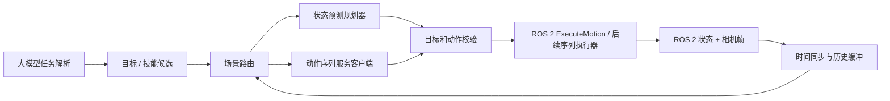

# 世界模型调用设计：动作服务与预测规划分开

状态：**这是可选策略对照的接口设计，不是世界模型规划主线**。接口客户端已实现；视觉采集、动作映射和整机闭环尚待目标资产验证。主线的训练与调用见[规划数据闭环](11_planning_world_model_pipeline.md)。机器人任务、摄像头、模型权重和动作语义尚未确定。本文件中的尺寸和频率来自参考项目的示例，不能直接当成机械臂、Go2 或 G1 的通用设置。

## 参考项目实际提供什么

参考仓库 [README](https://github.com/unitreerobotics/unifolm-world-model-action#readme) 将两种推理分开：decision-making 模式根据指令与观测产生动作序列；interactive simulation 模式根据图像、状态和动作条件生成未来视频。其 [部署客户端](https://github.com/unitreerobotics/unifolm-world-model-action/blob/main/unitree_deploy/unitree_deploy/utils/eval_utils.py) 向 `/predict_action` POST `language_instruction`、`observation.state`、`observation.images.top`、`action` 四个字段；[服务端](https://github.com/unitreerobotics/unifolm-world-model-action/blob/main/scripts/evaluation/real_eval_server.py) 返回 `result` 与 `action`。客户端用相机历史和状态历史，`action` 是零值条件输入；示例取动作 chunk 的前若干步执行。[机器人示例](https://github.com/unitreerobotics/unifolm-world-model-action/blob/main/unitree_deploy/scripts/robot_client.py) 有按 robot_type 固定的相机键、动作维数、初始姿态和控制频率。

这些代码没有给出本项目 `DynamicsModel.predict(joints, targets, duration_s) -> joints` 所需的任意动作状态转移调用，也没有提供可直接比较技能候选的成功概率。因此**不得**把 `/predict_action` 的动作张量写入 `PredictionReport.predicted_state`，或把未来视频当成已校准成功率。参考仓库是接口与方法参考，代码未复制到本项目；本项目的文件和类名按自身职责命名。

## 两条调用路径



1. **当前默认路径：状态预测规划。** `Goal(joint_goal)`、`Observation.joints` 经 `/wmal/plan` 调用本项目 `RolloutPlanner`。模型须实现 `predict(joints, targets, duration_s)` 并返回完整关节预测；规划器再输出 `Plan + PredictionReport`。这一接口适用于训练自己的动作条件状态模型。参考项目现有 HTTP 服务不能直接填充此协议。
2. **拟接入路径：视觉动作提议。** 经 ROS 2 的状态 topic 和拟新增的相机 topic 收集同一 episode 的两帧历史，交给 `ActionServiceClient.propose(ActionQuery)`。它调用独立 GPU 推理进程，并返回 `ActionChunk(model_version, actions)`。动作必须按机器人配置将向量逐维映射到关节命令，先做单位、范围、速度、时间戳和动作语义检查，再交给机器人执行器。该路径在没有目标模型资产、相机和映射配置前保持禁用。
3. **未来若使用视频世界模型做规划。** 定义独立的 `simulate(observation_history, candidate_action_chunk)` 接口返回未来视觉结果，再由与任务有关的检测器评分。需做候选动作与实际机器人动作对齐、模型误差校准和规划器利用误差测试。不能把 decision-making 服务当作这个接口。

## 动作服务请求与返回

已实现 [action_service.py](../src/wmal/models/action_service.py) 的纯 Python 客户端，可在无 ROS/GPU 的主机进行契约测试。请求示意：

```json
{
  "language_instruction": "move the arm to the target",
  "observation.state": [[0.0, 0.2], [0.1, 0.3]],
  "observation.images.top": ["RGB_CHW_uint8_frame_t-1", "RGB_CHW_uint8_frame_t"],
  "action": [[0.0, 0.0], [0.0, 0.0]]
}
```

示意 JSON 中图像字符串只是占位；实际请求由嵌套 `[C][H][W]` 的 0–255 整数数组组成。客户端校验历史长度、RGB 通道、图像尺寸、状态/动作维数、有限值、零动作条件、响应动作长度和数值；请求设超时、响应上限、禁止 HTTP 重定向，远程地址要求 HTTPS 或通过 SSH 隧道访问本地端口。一次超时不自动重试，避免在已变更观测后执行旧 chunk。客户端不接受服务端声称的成功概率。响应的 `model_version` 来自本地配置的权重标识，应由部署脚本锁定到具体 checkpoint 哈希；参考服务响应本身没有模型版本字段。

## ROS 2 / MuJoCo 对齐条件

| 边界 | 接入要求 |
|---|---|
| 图像 | MuJoCo 渲染节点发布 `sensor_msgs/Image`；相机名、RGB 顺序、分辨率和光学坐标系与模型训练数据一致。当前 RobotState 只含关节，尚无相机 topic。 |
| 同步 | 图像和关节状态带 episode_id、step_id、sim_time；历史帧时间严格递增，容许时间差在配置阈值内。重置清空历史；超时、缺帧和跨 episode 均拒绝推理。 |
| 状态 | 用显式 robot profile 的 `state_order` 和单位打包；不得依赖 dict 遍历顺序。模型可用关节子集须声明，未见模型的 Go2 不推定适用。 |
| 动作 | 配置 `action_order`、含义（绝对关节位置/增量/速度）、单位、控制周期、夹爪编码和归一化来源；维数一致后逐项映射，不静默截断或填零。参考服务端会按训练集统计量反归一化，但项目仍须校验部署数据集与机器人配置对应。 |
| 执行 | 当前 `ExecuteMotion` 一次只持有一个关节目标；最小适配只取 chunk 的首步，并在新观测后重推理。若要连续执行前 N 步，须新建序列 action，逐步反馈、可取消、每步限位和 episode 检查；N 和控制周期经实测确定。 |
| 规划 | 路由器依据模型能力选择状态预测或视觉动作提议；后者是策略基线/候选生成器，不自动构成高层 Agent 的预测可信度过滤机制。 |

Go2/G1 的浮基运动须由独立步态或平衡控制器处理。参考仓库的 G1/Z1 示例不证明 Go2 权重或动作映射可用。每个机器人与 checkpoint 需分别建立 `camera_key`、`state_order`、`action_order`、控制器和验证集，并在 MuJoCo 中做静态姿态、限位、单步与短 chunk 冒烟，再进行任务实验。

## 拟实现的运行时调用

```python
observation = ros_channel.observe()
frame = camera_channel.read_matching(observation.episode_id, observation.step_id)
history.append(observation, frame)
if not history.ready() or history.stale():
    hold_position()
    return
query = robot_mapper.build_query(task_instruction, history)
chunk = action_client.propose(query)             # 独立进程/GPU，设墙钟超时
command = robot_mapper.first_command(chunk, observation)
command.validate(robot_profile)
ros_channel.execute(command)                    # ROS 端再次校验并持有物理步进
fresh = ros_channel.observe()
record(observation, chunk, command, fresh, chunk.model_version)
```

`robot_mapper`、`camera_channel` 和上述调用循环是**待实现接口**；当前不运行这段伪代码。执行失败、模型超时或观测过期时保持当前位置/受控停止，返回错误给 Agent；只有新观测才允许重新推理。大模型只决定任务意图，低层动作由所选规划器或动作服务产生。实验记录请求 ID、episode/step、图像/状态时间、模型版本、动作序列、实际执行步数、延迟与终止原因，不保留私有思维过程。

## 验证门槛

第一步用假 HTTP 服务运行契约测试；第二步在 Ubuntu 构建相机与控制链，验证请求内容和真实推理服务返回；第三步使用固定模型权重和固定 MuJoCo 资产做短时执行与重置复现；最后比较“现有状态规划器”“视觉动作服务”和等预算组合机制。测试集按 episode/场景划分。视觉视频质量、动作误差、任务成功率与失败恢复分别报告。当前只通过第一步，不能声称参考模型已经在本项目的机器人仿真中运行。
