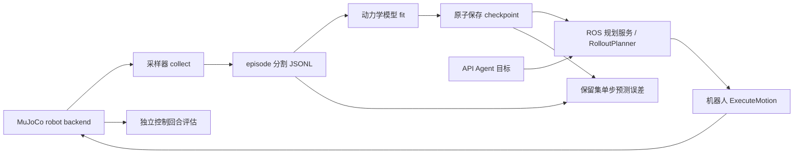

# 世界模型规划主线：MuJoCo 采样、训练、规划与评估

当前研究主线是**用动作条件动力学模型评估候选动作，滚动执行第一步，并在 MuJoCo 中收集独立实验数据**。高层 Agent 用 API 大模型解析任务，ROS 2 负责机器人状态、规划服务与执行 Action。任务尚未确定时，单关节探针仅验证链路。

## 方法参照与边界

[MBRL-Lib 官方仓库](https://github.com/facebookresearch/mbrl-lib) 明确分离动力学模型、模型环境、轨迹优化与采样，附有 MuJoCo 示例；[TD-MPC2 官方仓库](https://github.com/nicklashansen/tdmpc2) 提供状态或视觉观测下的世界模型短视野规划实现。这些仓库用于确认模块边界与实验组织。当前代码是独立编写的低维关节转移基线，使用 bootstrap 岭回归预测关节位移、随机候选序列搜索和滚动规划；**不复现上述论文的神经网络、奖励/价值训练或算法性能**。

此前研究的 [参考动作服务](https://github.com/unitreerobotics/unifolm-world-model-action) 返回语言条件动作序列，其 `/predict_action` 不提供任意候选动作的下一状态预测。它保留为可选策略对照，详见 [动作服务设计](10_world_model_call_design.md)，不进入本项目的世界模型规划主线，也不把其动作输出伪装成 `PredictionReport`。

## 已实现的数据与调用链



训练样本为 `(episode_id, step_id, sim_time_s, before_joints, commanded_joint_target, actual_duration_s, after_joints)`。采样器在每个 episode 重置 MuJoCo，以 episode 编号确定 train/validation/test；同一 episode 的相邻帧不跨集合。模型只使用训练集拟合；验证集报告误差；测试集留到 `evaluate.py`。模型状态是当前关节位置，动作是保持指定关节目标一段时长，输出下一时刻关节位置。`predict` 被 `RolloutPlanner` 注入使用，规划器输出带 `model_version`、观测步号和预测状态的 `Plan`。执行端再次检查 episode、step、关节限位与速度约束。

当前 bootstrap 成员间差异尚未校准，**不能解释为失败概率**。本阶段只报告单步预测 RMSE、控制成功率、控制步数和最终关节误差；多步误差与不确定性校准需后续实验。机器人策略看到关节状态；仿真真值作为评估资料时须与策略输入分开。

## 探针运行

在项目根目录、有 MuJoCo 和 NumPy 的环境中：

```bash
PYTHONPATH=src python scripts/collect.py --config configs/robots/interface_probe.json --output runs/probe/transitions.jsonl --episodes 10 --steps-per-episode 8 --seed 4
PYTHONPATH=src python scripts/train.py --dataset runs/probe/transitions.jsonl --checkpoint runs/probe/model.json --seed 4
PYTHONPATH=src python scripts/evaluate.py --config configs/robots/interface_probe.json --dataset runs/probe/transitions.jsonl --checkpoint runs/probe/model.json --output runs/probe/evaluation.jsonl --episodes 10 --seed 20
```

训练检查点接入 ROS 2 规划服务：

```bash
PYTHONPATH=src python scripts/serve_ros2.py planner --checkpoint runs/probe/model.json
```

机器人服务和 Agent 仍按 [ROS 2 启动文档](09_agent_ros2_design.md)运行。当前 macOS 主机没有 ROS 2，检查点加载到 ROS 服务的端到端路径需要在 Ubuntu 实测。`runs/` 是本地实验目录，不纳入 Git；正式实验需另存配置、随机种子、模型 hash、MuJoCo 版本、代码提交和原始输出。

## 扩到实际机器人场景的接口工作

1. 确定机械臂或 Go2/G1 的 MuJoCo 资产、关节/动作语义、控制器与任务终态；浮基机器人要有可验证的平衡/步态接口。当前单关节位置伺服模型不能迁移为整机动力学。
2. 在 `Observation` 添加任务必要的物体、接触、末端位姿或图像信息，同时保留关节状态和统一时间戳。模型输入与执行反馈必须来自同一控制周期。
3. 用非线性或潜在状态模型替换 `JointDynamics`，保留 `predict` 或引入显式 belief 状态；学习奖励/终端价值时重新定义目标和训练损失。不能沿用本基线名称声称实现某一论文算法。
4. 增加固定任务规划、无模型控制、相同模型但无高层预测反馈等对照；相同 episode/训练预算/观测/技能下做多训练种子评估，并报告交互数、想象步数、延迟和失败原因。
