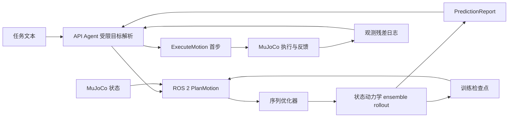

# 世界模型规划主线：MuJoCo 采样、训练、规划与评估

主线为动作条件模型评估候选动作序列，控制器只执行第一段，再用新观测重规划。API Agent 负责把文字任务变为经过限位检查的目标；ROS 2 传递状态、规划请求与执行动作；MuJoCo 节点独占物理步进。

## 开源项目方法与代码模块映射

| 参考实现 | 项目内对应功能 | 采用边界 |
| --- | --- | --- |
| [TD-MPC2](https://github.com/nicklashansen/tdmpc2) | 连续控制模型预测、潜在动力学预测接口；当前保留 `DynamicsModel` 接口 | 不移植其训练图、价值网络或任务嵌入；后续可实现为符合项目契约的可选后端 |
| [MBRL-Lib](https://github.com/facebookresearch/mbrl-lib) | 模型/规划器分离；`sequence_optimizer.py` 实现有界交叉熵序列优化 | 自行实现优化器与 rollout 适配，不引用已归档项目的运行时代码 |
| [DINO-WM](https://github.com/gaoyuezhou/dino_wm) | `visual_prediction.py` 提供图像特征编码、动作条件特征预测、目标图像规划契约 | 由明确配置的模型插件提供 `encode`/`predict_features`；语言到目标图像的映射尚未实现 |
| [JEPA-WMs](https://github.com/facebookresearch/jepa-wms) | 同一视觉预测契约支持未来接入时空特征预测后端 | 官方实现采用 CC BY-NC 4.0；本项目不复制其源代码/检查点，单独核实权重、数据及使用条件 |

以上是功能借鉴和适配接口，不表示复现了这些论文或沿用其结果。可选的语言条件动作服务仍由 [动作服务客户端](10_world_model_call_design.md)承担；它给出动作提议，不当成候选动作状态预测。

## 当前代码调用链



G1/UnifoLM 是一条并行研究路径：LeRobot episode 数据 → WMA 上游视频世界模型/决策微调 → 外部动作服务 → 同步 RGB/state 策略闭环。它不替代上图的数值状态模型与候选 rollout，也不会把视频预测误当作 `predicted_state`。数据 manifest、训练启动与外部服务接入见 [UnifoLM 指南](15_unifolm_training_adaptation.md)。

Agent 对模型报告只消费结构化预测；它不直接控制仿真器。执行端仍验证机器人 ID、episode、step、动作模式、持续时间、关节限位与速度限制。每次命令执行后，Agent 将预测的第一步状态与新观测比较，记录每关节残差和 RMSE，再发起下一次计划请求。ensemble spread 被记录为成员差异，尚未校准前不解释为任务失败概率。

训练样本为 `(episode_id, step_id, sim_time_s, before_joints, commanded_joint_target, actual_duration_s, after_joints)`。所有相邻帧随 episode 进入同一数据集合。状态基线由 `scripts/train.py` 训练；可选非线性模型由 `scripts/train_neural_dynamics.py` 训练，仅用 train 拟合、validation 选择、test 最终评估。规划器对每个成员滚动模拟候选序列，只发送第一段；`PredictionReport.predicted_state` 对应执行后第一步，`predicted_terminal_state` 对应规划终点。

## 采样、训练与评估命令

在 Ubuntu 项目环境安装 MuJoCo 采样依赖；训练神经网络时另装 learning extra：

```bash
python -m pip install -e '.[simulation,learning]'
python scripts/collect.py --config configs/robots/interface_probe.json --output runs/probe/transitions.jsonl --episodes 10 --steps-per-episode 8 --seed 4
python scripts/train.py --dataset runs/probe/transitions.jsonl --checkpoint runs/probe/model.json --seed 4
python scripts/train_neural_dynamics.py --dataset runs/probe/transitions.jsonl --checkpoint runs/probe/model.pt --members 5 --epochs 100 --seed 4
python scripts/evaluate.py --config configs/robots/interface_probe.json --dataset runs/probe/transitions.jsonl --checkpoint runs/probe/model.pt --output runs/probe/evaluation.jsonl --episodes 10 --seed 20
```

把已训练模型接到 ROS 2 规划服务：

```bash
python scripts/serve_ros2.py planner --checkpoint runs/probe/model.pt --device cpu
```

模型也可以用 `.json` 检查点加载线性基线。`MujocoEnvironment` 为采样和评估提供 action-duration 步进、RGB 渲染与状态快照；ROS 2 robot 节点继续独占异步物理步进。精确恢复需同时保存仿真状态、机器人资产及版本、环境 RNG 状态和外部扰动源随机状态。

## 视觉模型的接入契约

`GoalImagePlanner` 需要 `FeaturePredictor` 实现 `version`、`encode(rgb)` 和 `predict_features(start_features, action_sequence)`。模型必须返回 `[horizon, feature_dim]` 或 `[ensemble, horizon, feature_dim]`；规划器用动作序列预测特征与目标图像特征的距离来排序。视觉插件由配置显式加载，禁止从 LLM 输出中动态导入模块。当前 ROS `PlanMotion` 协议仍接收关节状态和关节目标，视觉规划尚未接入机器人端到端消息通路；完成具体任务、相机流与目标来源选型后再扩展消息契约。

## 证据边界与下一步

现阶段单关节探针只验证了状态预测/训练/仿真通信骨架；新加入的神经网络、序列优化、图像规划器与快照接口还没有运行验证。探针不能代表机械臂操作或 Go2/G1 控制能力。正式实验应选定资产和技能，测候选排序、逐步/终点预测误差、任务成功率、规划延迟和模型调用预算，并和相同训练数据及动作约束下的直接目标控制对照。

新增 WMA 接入脚本/ROS camera 消息也尚未在本次工作中执行验证。当前 G1 配置仍缺 MuJoCo 资产、关节限位与动作 schema，不应宣称 G1 闭环可运行；实际 GPU/CUDA 能力由用户本机环境提供，项目代码不会替代上游模型的显存与兼容性要求。
