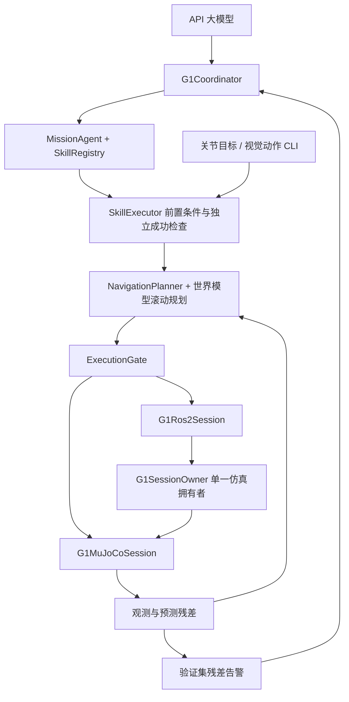

# Agent 架构优化与实施方案

目标：保留三种模型/控制语义，同时提供可验证的技能生命周期、任务级恢复、预测可靠性和 G1 ROS2 会话。

## 选择与取舍

采用增量适配：共享 TaskSpec、SkillSpec、ExecutionFeedback 和事件封装，保留各机器人专用状态与动作类型。直接把 G1 底座状态转换为关节 Observation 会丢失位置、速度和接触信息；一次性重写所有控制器会扩大回归范围，因此均不采用。

执行链为 API 任务解释 → 已注册技能 → 前置条件 → 世界模型滚动规划 → 执行门控 → direct/ROS2 会话 → 独立成功检查 → 统一反馈。G1 导航、关节目标和视觉动作服务分别注册为不同技能；能力不足时拒绝，不注册尚未实现的抓取。

## 恢复与预算

可恢复事件仅包括导航停滞、无可行候选、周期耗尽和校准残差触发。大模型接收原始指令、当前状态、失败事件及当前未完成目标，提出恢复航点；最后一个航点必须保持当前目标坐标与朝向，后续原始目标不变。任务总执行周期与重规划次数双重限额。通信不确定、跨回合、过期观测、姿态越界不自动恢复。

## 可靠性

验证集按 episode 划分。用每回合最大位置残差的经验分位数选择告警阈值，记录模型版本、动作时长、数据集 ID、回合 ID 和分位数。该阈值是经验残差告警值，不是成功概率，也不保证分布外覆盖。原 ensemble spread 与执行后残差分开记录。预测跨度改变时必须重新校准。

## G1 ROS2

新增独立 G1Session service；JSON 外壳有 schema、request_id、episode/step/sim_time 和场景摘要。服务端唯一拥有 MuJoCo，串行执行 observe/step/reset；动作最多 1 秒仿真时长，等待推理时仿真暂停。重复 request_id 返回缓存回执；不同内容复用 ID 拒绝，缓存淘汰后的旧步由状态版本拒绝。客户端动作超时后锁存，不自动重发。复位创建新会话、新 episode，使旧命令失效。客户端场景摘要须匹配服务端已知地图。此为仿真实验通信，不作为真机控制器。

## 实施与验收

1. 实现共享契约、技能注册/前置条件/执行器；三条路径写入相同 task_started/skill_result/task_result 事件。
2. G1 任务保留原始目标，加入有预算的 API 恢复及类型化失败原因。
3. 实现验证集残差校准 CLI、模型/时长检查及触发逻辑。
4. 实现 G1 会话协议、ROS2 服务与客户端、direct/ros2 CLI 选择。
5. 验证重复命令、复位旧动作、未知技能、虚假成功、恢复保留终点、总预算、校准泄漏和版本不匹配；运行现有相关测试。

ROS2 在无 rclpy 的机器上只能验证协议核心与导入/CLI，Ubuntu 双进程通信须另行实测。API 测试使用本地模拟提供商；不将其称为外部模型效果验证。论文增益需要多种子对照，当前实现不预设增益。

## 代码与接口



| 文件 | 责任与接口 |
|---|---|
| `skills/registry.py` | `SkillSpec` 定义参数/状态 schema、前置条件、执行回调、成功检查和周期上限；`SkillRegistry` 拒绝重复或未知技能 |
| `skills/executor.py` | `TaskSpec`、`ExecutionFeedback`；`SkillExecutor.run(name, parameters, session, budget)` 复核执行后的观测 |
| `agents/skill_adapters.py` | 将关节目标和视觉动作分支接入相同生命周期；不把视觉动作生成结果包装为状态预测 |
| `locomotion/mission.py` | 注册 navigate，维护原始目标列表、恢复航点、总周期、重规划次数 |
| `agents/g1_coordinator.py` | API 初始规划与恢复调用、单任务互斥、观测版本和一次性动作许可 |
| `models/calibration.py` | 按验证回合最大位置残差估计分位数阈值，保存校准来源 |
| `communication/g1_session_protocol.py` | 与 ROS 无关的服务端状态机、复位、幂等回执缓存和命令期限 |
| `communication/g1_ros2.py` | ROS2 服务工厂、远程会话和独立执行线程 |
| `analysis/agent_summary.py` | 汇总任务状态、技能结果、重规划次数、延迟和位置残差；保留 incomplete |

专用 `G1State`、`G1VelocityAction` 和原有关节 `Observation`/`MotionCommand` 保留。统一的是技能生命周期、反馈与预测报告结构；状态/动作单位仍必须按 schema 检查。G1Plan 的 `prediction_report()` 使用已有 PredictionReport，投影 x/y/height（米）与 yaw/roll/pitch（弧度），`horizon_steps` 为动作段数。视觉动作支线没有状态预测报告，不虚构可信度。

`G1Prediction.uncertainty_kind` 允许 unavailable、unspecified、ensemble_spread、aleatoric_variance。轻量集成模型明确标记 ensemble_spread。规划代价只对声明为集成 spread 的 `position_variance` 开平方后加权，约定该字段单位为 m²；不再将混合单位的姿态方差与位置方差直接相加。新增外部适配器必须遵守该单位约定。

## 启动与对照

在项目根目录、具备现有 G1 资产、ONNX 行走策略与预测检查点的环境中执行。API 环境变量沿用 `docs/20_llm_coordination.md`。

```bash
PYTHONPATH=src python scripts/g1_llm_agent.py --headless \
  --instruction '前往世界坐标 (1,0)' --max-replans 2 --max-total-cycles 300
```

`--max-replans 0` 关闭任务级 API 恢复；默认 CLI 为 2 次。库调用 G1Coordinator 默认仍为 0，便于原实验保持既有设置。每次 API 内部 HTTP 重试由现有客户端独立限制；任务重规划次数不等于 HTTP 尝试次数。一次任务最多允许 `1 + max_replans` 次语义规划调用。执行反馈仅调节下一轮速度范围，校准残差连续两次超限才请求任务重规划。

ROS2 路径先激活已配置的 Ubuntu ROS2 环境，在项目根目录编译接口；两个终端均须 source 相同 overlay，并能导入项目与仿真依赖。

```bash
colcon build --base-paths ros2 --packages-select wmal_interfaces
source install/setup.bash
PYTHONPATH=src python scripts/serve_g1_ros2.py
```

另一个终端：

```bash
source install/setup.bash
PYTHONPATH=src python scripts/g1_llm_agent.py --transport ros2 \
  --instruction '前往世界坐标 (1,0)' --max-replans 2 --max-total-cycles 300
```

服务 `/wmal/g1/session` 使用 `wmal_interfaces/srv/G1Session`。request 是 JSON，observe 请求包含 schema/request_id/scene_id/operation；step 另外包含 episode_id、step_id、sim_time_s、expires_at_unix_s 和 action（vx/vy 为机身坐标 m/s，yaw_rate 为 rad/s，duration_s 为秒）。服务端严格检查字段与状态版本。reset 同样绑定当前状态和期限，调用 `G1Ros2Session.reset()` 显式复位；协调器故障锁存后应建立新协调器，并明确复位服务端后再运行任务。

期限使用 Unix 墙钟秒，默认同一 Ubuntu 主机。跨机器需要校时，尚未验证。observe 通过服务读取当前状态，不依赖积压的状态 topic；step 绑定调用者上次读取的观测，服务器拒绝随后已发生变化的状态。等待网络或推理时物理步进暂停。客户端超时无法撤回已经开始的物理动作，因此锁存故障；服务端丢弃尚未开始且已过期的请求。相同 ID 回执缓存默认 256 条，淘汰后旧步仍被状态版本校验拒绝。缓存不跨进程重启保存，重启生成新 episode。

## 校准与数据输出

可以直接用现有采集脚本输出的数据集，计算指定检查点在 validation 回合上的位置预测误差：

```bash
PYTHONPATH=src python scripts/calibrate_residuals.py \
  --dataset data/g1_locomotion/transitions.json \
  --checkpoint runs/g1_research/model.json \
  --output runs/g1_research/residual_calibration.json
PYTHONPATH=src python scripts/g1_llm_agent.py --headless \
  --calibration runs/g1_research/residual_calibration.json \
  --instruction '前往世界坐标 (1,0)'
```

要求至少两个独立验证回合；这是输入最低要求，正式研究需要更多回合。模型的训练数据来源仍须由实验 manifest 审计；工具能检查当前数据集的回合划分冲突，不能从权重中识别隐含训练泄漏。阈值受回合长度分布影响，应固定采集协议并另测分布偏移。

外部模型可输入 JSONL，每行：

```json
{"episode_id":"val-001","split":"validation","model_version":"model-v1","duration_s":0.5,"position_error_m":0.03}
```

使用 `--input residuals.jsonl --excluded-episodes train_test_ids.json --model-version model-v1 --duration 0.5 --dataset-id dataset-v1 --output calibration.json`。excluded 文件为训练/测试 episode ID 字符串列表。日常事件日志不会自动标为 validation，禁止直接混入测试数据拟合阈值。

三种 CLI 模式共用 task_started、skill_result、task_result 事件和 task_id。G1 额外记录恢复请求、保留的终点、预测残差、校准数据来源及速度缩放。视觉分支只记录动作服务输出和执行反馈。日志中的状态是 MuJoCo 状态观测，G1 已知地图也是系统输入；不能将这些实验称为纯视觉评估。

```bash
PYTHONPATH=src python scripts/summarize_agent.py \
  --input runs/g1_llm/events.jsonl --output runs/g1_llm/summary.json
```

汇总保留缺失终态的 incomplete 任务、未知执行次数 null 和 uncertain_commands。cycles 是已完成的执行周期；发生不确定命令时，不可据此推断实际物理交互量或零成本。当前报告是描述统计，不能代替多训练种子置信区间。

## 验证与边界

```bash
PYTHONPATH=src python -m unittest discover -s tests -p 'test_agent_architecture.py' -v
PYTHONPATH=src python -m unittest discover -s tests -p 'test_g1_coordinator.py' -v
PYTHONPATH=src python -m unittest discover -s tests -p 'test_g1_ros2_integration.py' -v
```

最后一项只有安装 rclpy 并编译接口后才运行，在其他环境明确 skip。它验证实际 ROS2 service 传输，使用测试会话；真实 MuJoCo 的 ROS2 双进程演示仍须在 Ubuntu 执行上面的服务端/客户端命令。

已实现：共享技能执行、G1 有预算的任务恢复、验证集阈值工具、ROS2 会话协议与入口、日志汇总。尚未实现：机械臂抓取策略、Go2 行走策略自动选择、视觉状态模型与 G1 控制语义自动对齐、跨技能自由规划、概率型任务失败预测器。同步插件阻塞不能被 Python 外层计时强制中断；本地规划超时是在返回后拒绝动作。新增功能不构成论文性能增益的证据。

### 本地验证记录

2026-09-30：在项目 `.venv` 中执行 `PYTHONPATH=src .venv/bin/python -m unittest discover -s tests -v`，共 85 项，84 项通过，1 项 ROS2 实际通信测试因本机没有 rclpy/生成接口而跳过。新增架构行为测试共 23 项，覆盖三分支技能适配、API 恢复、预算、原目标保留、残差校准、旧回执、重复动作、超时锁存及统计输出。现有本地 HTTP 服务与真实 MuJoCo 的 G1 协调端到端测试通过；它使用测试预测模型，不代表外部大模型或训练模型性能验证。为运行既有行走测试，在本地 `.venv` 安装了项目 walking extra 所需的 onnxruntime。`git diff --check` 通过。
