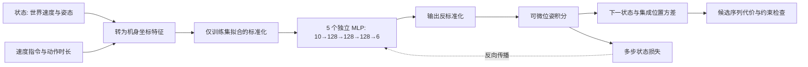

# 规划用动作条件世界模型训练网络

## 目标与工作假设

首个训练对象是当前已具备采样与规划接口的 G1 浮动底座导航。模型预测低层速度策略作用后的底座运动，输入是状态与机身速度动作，不需要语言输入。语言目标进入规划代价，不混入动力学网络。机械臂继续使用既有关节模型；Go2 接入时须重新定义状态、低层策略和数据，不能复用 G1 权重。

采用神经动力学集成，增加对非线性动作响应的表达能力。暂不采用视觉生成模型或循环隐状态网络：现有数据主要是状态转移，增加图像或历史状态前需要先确定观测与采集契约。当前模型是可训练状态世界模型基线，部分可观测性由后续带历史的模型研究。

## 网络与训练

每个成员是独立的多层感知机：10 维输入 → 可配置隐藏层（默认 128×3，SiLU）→ 6 维输出。输入为机身坐标速度 vx/vy、yaw_rate、roll、pitch、pelvis_height、指令 vx/vy/yaw_rate 和动作时长。输出为该动作段的平均机身速度、平均角速度及末端 roll/pitch/height。

可微积分层将速度转换为世界坐标位移和朝向，将输出姿态写入预测状态。位置与 yaw 从上一预测递推；预测速度采用动作段平均值近似末端速度，这一近似须由多步误差验证。关节与接触字段透传，不视为模型预测能力。

仅用 train 数据拟合输入/输出归一化。ensemble 成员按 episode bootstrap；单步标准化输出 MSE + 多步状态误差组合，滚动时把预测状态送入下一步网络，梯度经过积分与前序预测。多步状态损失尺度固定为位置 0.1m、yaw 0.2rad、速度 0.3m/s、yaw_rate 0.5rad/s、姿态 0.2rad、height 0.1m。校验集平均成员多步损失用于选择最佳 epoch；test 只在显式 evaluate 命令中使用。

## 数据与检查点

复用 `wmal.g1.transitions.v1` JSON。按 episode 检查 split 唯一、step/time/动作时长一致、相邻记录状态连续、关节 schema 一致；序列不跨 episode 或缺口。第一版固定动作时长，拒绝混合时长。

保存最佳推理权重和 latest 训练快照。快照含全部网络、优化器、归一化、epoch、配置、数据摘要及最佳指标。bootstrap 和 batch 顺序由 seed/member/epoch 确定，resume 验证数据摘要和超参数，允许只增加总 epoch。保存使用原子替换。版本由权重、归一化与架构内容生成摘要。

## 推理与验收

插件提供 `predict(G1State, G1VelocityAction, duration_s) -> G1Prediction`，与现有 G1RolloutPlanner、Agent、direct/ROS2 会话兼容。成员间预测位置方差标为 ensemble_spread；不输出成功概率。动作时长、模型版本、设备和 schema 均显式检查。

验收：数据泄漏与断序测试、梯度经多步递推、训练损失下降、保存加载预测一致、断点续训与连续训练一致、测试集不参与选择、实际 MuJoCo 小规模采样训练、训练模型进入规划器。小规模结果仅验证工程链路，不证明研究性能。

## 已实现模块

| 模块 | 文件 |
|---|---|
| 状态/动作序列与回合划分检查 | `src/wmal/datasets/motion_sequences.py` |
| 网络、可微积分、集成推理、原子权重保存 | `src/wmal/models/motion_network.py` |
| 多步训练、验证选择、断点续训、独立评估 | `src/wmal/training/motion_trainer.py` |
| MuJoCo 采样、失败记录、数据来源清单 | `src/wmal/training/motion_collector.py` |
| collect/train/evaluate 命令 | `scripts/train_motion_network.py` |
| 默认网络训练配置 | `configs/training/motion_network.json` |
| 小规模链路测试配置 | `configs/training/motion_network_smoke.json` |
| G1 规划器接入配置 | `configs/g1_neural.json` |



默认网络共 176,030 个参数。所有网络权重可训练，归一化统计和积分公式固定；没有预训练视觉编码器或 LLM 参数参与反向传播。训练数据全部来自 MuJoCo 交互；多步预测用于计算监督损失，不作为新增真实交互数据写回回放池。动作序列由既有规划器优化，训练器不更新低层 ONNX 行走策略。

输入标准化对恒定维度设最小尺度 0.01，目标同样处理；多步损失角度差采用 atan2(sin Δyaw, cos Δyaw)。第一版固定数据时长以避免把不同动作保持周期混为同一系统。模型版本绑定权重、架构、归一化和动作时长；更换权重后需重新校准残差阈值。

## 从采样到规划

下面命令均在项目根目录运行。使用与已安装 PyTorch/MuJoCo 兼容的 Python 环境；项目已有 `learning`、`simulation`、`walking` 可选依赖。

```bash
python -m pip install -e '.[learning,simulation,walking]'

# 明确分开训练/验证/测试回合；输出存在时拒绝覆盖。
PYTHONPATH=src python scripts/train_motion_network.py collect \
  --output data/g1_locomotion/neural_transitions.json \
  --train-episodes 8 --validation-episodes 3 --test-episodes 3 \
  --steps 100 --seed 0

# 训练。test 只统计预留回合数量，不参与梯度或检查点选择。
PYTHONPATH=src python scripts/train_motion_network.py train \
  --dataset data/g1_locomotion/neural_transitions.json \
  --checkpoint runs/motion_network/model.pt \
  --config configs/training/motion_network.json

# 从 latest 快照继续，epochs 是总训练轮数。
PYTHONPATH=src python scripts/train_motion_network.py train \
  --dataset data/g1_locomotion/neural_transitions.json \
  --checkpoint runs/motion_network/model.pt \
  --config configs/training/motion_network.json \
  --resume runs/motion_network/model.latest.pt --epochs 150

# 模型冻结后显式评估保留测试集。
PYTHONPATH=src python scripts/train_motion_network.py evaluate \
  --dataset data/g1_locomotion/neural_transitions.json \
  --checkpoint runs/motion_network/model.pt --split test --horizon 3 \
  --output runs/motion_network/evaluation.json

# 由训练网络为世界模型规划器预测，环境判定目标是否完成。
PYTHONPATH=src python scripts/g1_agent_sim.py \
  --config configs/g1_neural.json --headless --goal '0.6 0'
```

训练过程中每轮输出 train_loss、validation_loss、best_epoch 和耗时。输出包括：

- `model.pt`：验证集选出的推理权重；文件已存在时，非 resume 训练拒绝覆盖。
- `model.latest.pt`：全部成员的最后训练状态和优化器，用于中断恢复。
- `model.pt.report.json`：配置、数据摘要、版本、每轮指标、划分数量和检查点摘要。
- `evaluation.json`：每个预测步长的位置 RMSE 与按 episode 分组的结果；重叠序列不能当作独立实验重复。

CPU 已实测。`--device cuda`/`mps` 交由本机 PyTorch 支持，当前未做 GPU 或 MPS 验证，也没有承诺相同设备外的逐位复现。断点续训要求同一数据摘要和同一配置，只有总 epochs 可以增加。网络没有 dropout；episode bootstrap 与 batch 顺序由 seed、member、epoch 确定。新进程恢复后可重复这些随机选择。

大模型任务入口同样可以直接选择该配置：

```bash
PYTHONPATH=src python scripts/g1_llm_agent.py --config configs/g1_neural.json \
  --headless --instruction '前往世界坐标 (0.6,0)'
```

ROS2 仿真服务已启动时，增加 `--transport ros2`。Agent 进程负责预测，仿真进程保持物理步进拥有权；离线训练独立启动，不进入控制回调。正在运行的 Agent 保持已加载权重，训练完成后启动新会话加载新版本。

## 与残差校准连接

```bash
PYTHONPATH=src python scripts/calibrate_residuals.py \
  --dataset data/g1_locomotion/neural_transitions.json \
  --checkpoint runs/motion_network/model.pt \
  --factory wmal.models.motion_network:load \
  --output runs/motion_network/calibration.json

PYTHONPATH=src python scripts/g1_llm_agent.py --config configs/g1_neural.json \
  --calibration runs/motion_network/calibration.json \
  --headless --instruction '前往世界坐标 (0.6,0)'
```

校准器只使用 validation 回合，并核对检查点记录的训练回合。当前阈值是经验残差告警；验证集同时用于检查点选择时，更不能将其称为具有独立覆盖保证的 conformal 区间。正式实验应保留单独的校准子集，并增加分布偏移测试。

## 2026-09-30 本地实测

本地 smoke 数据、权重和报告位于 `runs/motion_network_smoke/`，属于 Git 忽略的实验产物。数据来自真实执行的 MuJoCo 仿真，不是合成状态测试夹具。

- 数据：4 个训练回合、2 个验证回合、2 个保留测试回合，每回合 16 条，共 128 条转移；采样动作失败记录为 0。
- 网络：3 个独立成员，每个 32×32 隐藏层，总参数 4,818；40 epochs，CPU，seed=7。
- 训练损失：0.8543 → 0.3526；验证损失：1.1944 → 0.8340，选择第 40 轮（内部 epoch=39）。这些是组合损失，不是米或弧度。
- 版本：`motion-b06413e7d1cefe9c`。
- 保留测试集 1/2/3 步位置 RMSE：0.0401 / 0.0755 / 0.0987 m；每步 0.5 s。
- 使用该模型驱动规划器，目标 `(0.6, 0)`，位置容差 0.15 m：4 个控制周期后环境观测满足目标，最终 `(0.4563, -0.0309)`；日志在 `closed_loop.jsonl`。
- 验证回合经验残差阈值约 0.0748 m，只有两个回合，不能用于证明校准质量。

复跑已保存的小模型闭环：

```bash
PYTHONPATH=src python scripts/g1_agent_sim.py \
  --config runs/motion_network_smoke/agent_config.json --headless --goal '0.6 0'
```

神经网络专项测试覆盖学习下降、保存加载一致性、多步梯度、连续/恢复训练一致性、测试集不影响训练、数据泄漏/重复/断序检查。当前小样本和单一导航目标仅证明训练至规划的工程链路，不能支持优于回归基线、跨机器人泛化或论文性能增益的结论。采样动作分布与规划器搜索分布也需对齐后再进行正式比较。

历史回归记录：当时共 91 项，90 项通过，1 项 ROS2 实际通信测试因缺少本地 ROS2 环境跳过；`git diff --check` 通过。当前统一在 `conda activate wmal` 后执行 `PYTHONPATH=src python -m unittest discover -s tests -v`；最新结果以视觉网络验收文档的统一环境复验为准。
