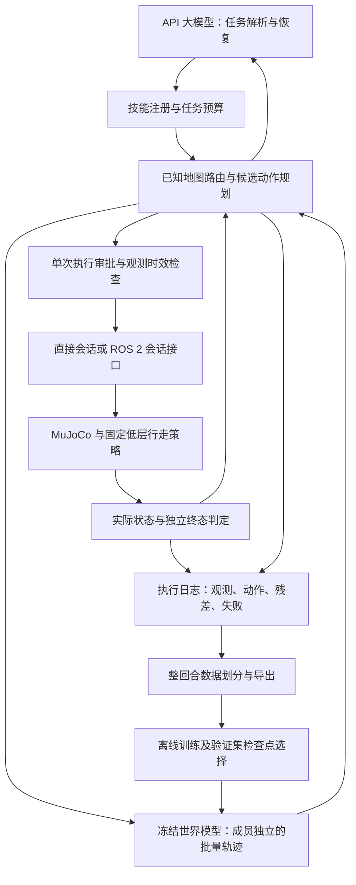

# 规划世界模型训练与 Agent—机器人闭环

本次交付包含可训练的状态潜在动力学网络、批量多步预测、规划证据及执行数据回流。文件按功能命名，代码独立编写；参考机制与来源在下面逐项列出。工程实现独立不等于算法新颖性已成立，也不能通过更改名称证明原创性。

## 1. GitHub 源码证据与路线选择

以下为 2026-09-30 使用 GitHub 插件读取的固定源码版本。依据具体函数及训练路径，不以 README 宣传作为已验证性能证据。

| 参考项目与固定版本 | 阅读位置 | 源码机制 | 本项目采用或调整 | 未迁移部分与验证要求 |
|---|---|---|---|---|
| [TD-MPC2](https://github.com/nicklashansen/tdmpc2/tree/e9f59321933cbc8e11a002b842adc7d4ffae8ff1) | [`_update`, L259–313](https://github.com/nicklashansen/tdmpc2/blob/e9f59321933cbc8e11a002b842adc7d4ffae8ff1/tdmpc2/tdmpc2.py#L259)；[`WorldModel`](https://github.com/nicklashansen/tdmpc2/blob/e9f59321933cbc8e11a002b842adc7d4ffae8ff1/tdmpc2/common/world_model.py#L17) | 编码状态、动作条件潜在转移、无梯度下一状态目标、折扣多步一致性；另有奖励、Q 集成和策略先验 | 借鉴动作条件潜在转移与多步一致性；加入本项目物理状态监督与重构约束，使用独立编写的确定性动力学集成 | 不训练奖励/Q/策略，不声称复现该算法；Q 集成不是动力学集成；所读更新函数没有 EMA 目标编码器，本项目也未引入 EMA 编码器 |
| [DINO-WM](https://github.com/gaoyuezhou/dino_wm/tree/0a9492fa12044b852ae9e001cc74604b79c8bb0c) | [`forward`, L189–263](https://github.com/gaoyuezhou/dino_wm/blob/0a9492fa12044b852ae9e001cc74604b79c8bb0c/models/visual_world_model.py#L189)；[`rollout`, L284–309](https://github.com/gaoyuezhou/dino_wm/blob/0a9492fa12044b852ae9e001cc74604b79c8bb0c/models/visual_world_model.py#L284)；[`CEM.plan`](https://github.com/gaoyuezhou/dino_wm/blob/0a9492fa12044b852ae9e001cc74604b79c8bb0c/planning/cem.py#L64) | 特征预测目标 detach；历史窗口滚动；批量候选动作与目标特征代价 | 借鉴批量候选 rollout 的调用组织；当前使用状态编码而非视觉编码，规划保留每个动力学成员自己的整条轨迹 | 不加载视觉权重、图像重建器或目标图像规划；语言→目标图像尚未实现；当前随机采样规划没有实现迭代 CEM |
| [DreamerV3](https://github.com/danijar/dreamerv3/tree/e3f02248693a79dc8b0ebd62c93683888ddaccfe) | [`observe/imagine/loss`, L61–133](https://github.com/danijar/dreamerv3/blob/e3f02248693a79dc8b0ebd62c93683888ddaccfe/dreamerv3/rssm.py#L61)；[`Agent.policy`](https://github.com/danijar/dreamerv3/blob/e3f02248693a79dc8b0ebd62c93683888ddaccfe/dreamerv3/agent.py#L115) | 观测后验与想象先验分开；回合 reset 屏蔽旧状态；策略在执行时输出动作 | 采用观测与模型想象数据分开记录、回合边界检查；本项目在候选想象内保留潜在状态，每次真实观测重新编码 | 不是 RSSM，没有随机状态、KL 或想象 actor–critic；不将 Dreamer 描述为每步在线 MPC；跨真实控制周期的历史状态估计需后续实现 |
| [UniFoLM-WMA](https://github.com/unitreerobotics/unifolm-world-model-action/tree/3e198de68de55f93f24b3ad623dd499390aaee45) | [`predict_action`, L370–446](https://github.com/unitreerobotics/unifolm-world-model-action/blob/3e198de68de55f93f24b3ad623dd499390aaee45/scripts/evaluation/real_eval_server.py#L370)；[`train/config.yaml`](https://github.com/unitreerobotics/unifolm-world-model-action/blob/3e198de68de55f93f24b3ad623dd499390aaee45/configs/train/config.yaml) | 图像、状态、语言输入；状态/动作标准化、统一维度映射、动作 mask、输出反标准化 | 将视觉动作生成服务保留为第二实验数据源；明确其输出与 G1 底座速度指令不能直接互换 | 本轮没有训练、加载或复制该项目模型代码；其 [LICENSE](https://github.com/unitreerobotics/unifolm-world-model-action/blob/3e198de68de55f93f24b3ad623dd499390aaee45/LICENSE) 标为 CC BY-NC-SA 4.0，后续引入代码或权重应分别核实适用范围 |

前三个项目所查仓库许可证为 MIT（DINO-WM 的 [LICENSE](https://github.com/gaoyuezhou/dino_wm/blob/0a9492fa12044b852ae9e001cc74604b79c8bb0c/LICENSE) 已读取）。本次没有搬入上游实现文件或预训练权重。上游源码的机制可行性不直接证明迁移到本机器人后的效果。

选择状态条件、短视野滚动规划作为可训练主线：已有 G1 MuJoCo 轨迹、明确的速度动作接口及独立环境成功检测。视觉动作生成支线仍走独立服务接口。本项目自己的损失和集成不能继续沿用某个上游算法名称。

## 2. 分层架构及接口



| 模块 | 本轮实现 | 跨层语义 |
|---|---|---|
| `models/motion_network.py` | 原物理网络 v1 + 潜在状态网络 v2；训练/加载/保存；批量 rollout | 输入 body-frame `vx,vy,yaw_rate,duration_s`，输出 world-frame 状态；权重、归一化、架构一起参与模型版本计算 |
| `training/motion_trainer.py` | 单步物理监督、多步物理误差、潜在一致性及状态重构；整回合 bootstrap | 标准化仅用 train；只用 validation 选检查点；test 保留到冻结后独立评估 |
| `locomotion/rollouts.py` | `EnsembleRollout` | 张量 `[member,candidate,horizon,9]`；附初始 episode/step/time、全部候选动作、模型版本；有限值及维度验证 |
| `locomotion/world_model.py` | 可选 `rollout(state,candidates)`，保留 `predict` 的插件兼容路径 | 返回批量数据必须对应原观测和原候选；模型推理异常不自动换模型 |
| `locomotion/planner.py` | 成员轨迹约束筛选、候选评分、模型调用与想象步计数 | 只执行最优序列首段；每次得到真实状态后重新规划；原 scalar provider 仍可运行 |
| `agents/g1_coordinator.py` | 恢复请求中加入最多五项有效候选摘要、拒绝数和证据年龄 | 证据仅来自同回合、当前或前一控制步；语言恢复必须保留原始任务终点，不可自行宣告成功 |
| `locomotion/agent.py` | 候选证据日志和 `executed_transition` | 只在动作返回并取得新观测后记录完整 transition；未知/部分执行保留失败日志，不能当完整训练样本 |
| `datasets/execution_export.py` | 从执行日志导出训练格式 | 操作者显式声明 MuJoCo 来源、指定整回合 split；导出前检查重复、时间对齐、相邻状态及集合泄漏 |

`rollout` 示例：

```python
model = load_world_model('wmal.models.motion_network:load', {'checkpoint': 'runs/planning_network/model.pt'})
batch = model.rollout(observation, [[action_a, action_b], [action_c, action_d]])
first = batch.prediction(candidate=0, step=0)
terminal = batch.prediction(candidate=0, step=1)
```

原来的低层状态接口、ROS 2 请求标识、复位、超时与旧动作丢弃规则继续由会话层执行，参见 [Agent 运行架构](agent-runtime.md)。世界模型推理在规划进程中进行，训练为独立离线任务；当前不在物理步进线程中训练，也不在任务中自动热换权重。原子保存保障完整文件发布；重建模型实例后才使用新权重。

## 3. 网络与梯度路径

网络输入十维：当前体坐标系线速度二维、角速度、roll、pitch、pelvis height，以及动作三维与保持时间。位置和 yaw 用于物理积分，不作为绝对地图坐标输入神经网络，避免把平面位移误当动力学差异。

v2 包含状态编码器 `e(s)`、残差潜在转移 `f(z,a)`、物理预测头 `g(z,z_next,a)`、状态特征重构头。潜在维度为最后一个 hidden width。当前为确定性模型；独立初始化且按回合 bootstrap 的多个成员构成动力学集成。

九维预测目标顺序：初始体坐标系平均位移速度二维、平均 yaw 变化率、末端 roll/pitch/height、末端体坐标系线速度二维、末端角速度。前三项负责积分位姿；最后三项独立预测末端速度，以正确建立下一个动作的起始状态。yaw 差使用角度环绕。

```text
监督头损失 = normalized_target_outputs 的单步 MSE
物理滚动损失 = 各步预测状态与实测状态的加权尺度化 MSE
潜在一致性 = f 的开放滚动结果与 stop_gradient(e(actual_next_state)) 的加权 MSE
重构约束 = reconstruction(e(actual_state)) 与归一化状态特征的 MSE
总损失 = 监督头损失 + rollout_weight × 物理滚动损失
         + latent_weight × (潜在一致性 + 重构约束)
```

三步损失权重为 `horizon_decay ** step`，按权重和归一化。位置尺度 0.1 m、yaw 0.2 rad、速度 0.3 m/s、yaw rate 0.5 rad/s、roll/pitch 0.2 rad、height 0.1 m。参数均显式配置，非可证明最优值。

每个成员从同一真实起点编码一次；之后保留自己的潜在状态及物理状态，训练与推理都不在每步取集成均值作为新起点。梯度通过预测状态积分、潜在转移和物理读出传到所有前序步骤；下一真实状态编码作为目标时 detach，重构和单步监督仍训练编码器。低层 ONNX 行走策略保持冻结。

训练按固定种子构造整回合 bootstrap、确定性 batch 顺序；梯度裁剪上限 10。保存完整优化器及最佳权重，恢复时校验数据 SHA、归一化与配置，允许增加总 epochs。训练报告记录网络和训练源码 SHA，区分未提交源码与 Git 提交版本。v1 检查点可继续加载，原 v1 损失不加入潜在项或新折扣。

模型只预测九个基座字段；关节、contact、vz 在适配结果中继承原观测，不能视为预测值。每次真实观测重新编码，没有跨观测周期的历史滤波，尚不能声称解决部分可观测性。后续可独立研究关节/contact 历史条件或随机状态模型。

## 4. 预测可信度与 Agent 决策

`position_variance` 为各成员预测 `(x,y)` 的方差和，单位 m²；候选终点 spread 为其平方根，单位 m。成员保留完整轨迹后，该值包含各成员预测差异的多步累积。它是模型分歧指标，不是校准的失败概率、随机噪声方差或安全保证。`success_probability` 当前明确为 null。

规划目标使用末端距离、yaw 误差、姿态项、控制代价及累计位置 spread。每个成员的姿态与场景轨迹均检查约束；只检查均值会漏掉成员预测出的约束违例。该筛选是启发式保守决策，不意味着真实执行一定满足约束。

`plan.planning_evidence` 记录候选编号、代价或拒绝原因、终态距离、终态 spread、首动作、选中候选、模型版本、想象步数与逻辑模型步调用数。候选想象步定义为 `member × candidate × horizon`；批量逻辑调用数为 `member × horizon`，并不是物理交互数或每一层算子的调用数。

实测执行残差单独记录。验证集拟合的回合最大残差经验分位数用于已有事件触发重规划；每次切换模型必须重做校准。该阈值不校准 ensemble spread，也不保证测试覆盖率。小样本校准结果只适合接口冒烟验收。

高层语言 Agent 在任务恢复时可读取候选摘要与拒绝信息，结合当前观测插入有限导航路点；低层每个控制段的选择直接使用预测结果。若移除高层证据，恢复调用会缺少这些模型证据，但底层仍可使用世界模型。初始语言规划仍是受限导航任务解析，没有实现任意技能的高层模型候选评分。消融需分别命名高层证据移除和全系统世界模型移除。

训练动作覆盖、规划视野、隐藏摩擦及 gait phase 变化可能导致预测偏移。应扩充与部署控制包络一致的数据，在 validation 上选择视野与代价，不可用测试表现反复调参。使用模型优化动作也可能利用模型误差，需记录候选 spread、残差与失败。

## 5. 可运行入口与数据回流

在项目根目录、安装 simulation/walking/learning 依赖且已有 G1 资产的环境中：

```bash
# 采集真实 MuJoCo 交互；按整回合分 train/validation/test。
PYTHONPATH=src python scripts/train_motion_network.py collect --output runs/planning_network/transitions.json
# 主线训练；smoke 配置仅用于管线验收。
PYTHONPATH=src python scripts/train_motion_network.py train --dataset runs/planning_network/transitions.json --checkpoint runs/planning_network/model.pt --config configs/training/planning_network.json
# 恢复：总 epochs 包含已完成 epochs。
PYTHONPATH=src python scripts/train_motion_network.py train --dataset runs/planning_network/transitions.json --checkpoint runs/planning_network/model.pt --config configs/training/planning_network.json --resume runs/planning_network/model.latest.pt --epochs 150
# 冻结后独立评估和验证残差校准。
PYTHONPATH=src python scripts/train_motion_network.py evaluate --dataset runs/planning_network/transitions.json --checkpoint runs/planning_network/model.pt --output runs/planning_network/evaluation.json
PYTHONPATH=src python scripts/calibrate_residuals.py --dataset runs/planning_network/transitions.json --checkpoint runs/planning_network/model.pt --factory wmal.models.motion_network:load --output runs/planning_network/calibration.json
# 世界模型与 MuJoCo 的闭环；API Agent 入口使用现有环境变量读取凭据。
PYTHONPATH=src python scripts/g1_agent_sim.py --config configs/g1_planning_network.json --headless --goal '0.6 0'
PYTHONPATH=src python scripts/g1_llm_agent.py --config configs/g1_planning_network.json --transport ros2 --calibration runs/planning_network/calibration.json --instruction '前往指定导航位置'
# 对相同模型与轨迹语义比较批量和逐候选推理，输出原始延迟样本。
PYTHONPATH=src python scripts/benchmark_motion_rollout.py --dataset runs/planning_network/transitions.json --checkpoint runs/planning_network/model.pt --output runs/planning_network/latency.json
```

ROS 2 入口需要另起会话服务器，见 [现有 ROS 2 会话指南](agent-runtime.md)；这里不声称本机已具备 Ubuntu/rclpy。任务文字只是示例，实际位置必须能由任务与场景解析确定。

执行数据回流示例：

```json
{"episode-uuid-a":"train", "episode-uuid-b":"validation", "episode-uuid-c":"test"}
```

把映射保存成 split-map.json，然后：

```bash
PYTHONPATH=src python scripts/train_motion_network.py export-execution --logs runs/planning_network/agent.jsonl --split-map split-map.json --source mujoco_interaction --output runs/planning_network/executed_transitions.json
```

一次回合的全部技能与恢复动作必须归同一集合；固定测试的动作不能进入后续训练或校准。导出数据保留行为模型版本、任务标识、日志 SHA 和失败事件；只导出一个训练回合不满足训练入口要求的三个集合。相邻帧从不随机跨集合。当前尚未实现自动聚合多批数据或在线适应。

`executed_transition` 是学习数据，未包含完整 MuJoCo 积分状态及控制器内部历史，不能用来声称逐位精确重放。想象轨迹只用于损失或规划统计，本轮没有混合进真实 MuJoCo transition 数据，也没有训练 MBPO 式策略。

## 6. 实验与验收

主要研究假设仍为：动作条件预测及经验证集校准的可靠性反馈能否改善技能执行与有限预算恢复。网络升级本身是工程主线；不把增加模块数量当创新。

| 对照 | 必须保持一致 | 主要数据 |
|---|---|---|
| 物理 v1 与潜在 v2 | MuJoCo 数据划分、观测、低层策略、场景与独立终态判据；分别披露参数量及训练时间 | 1/2/3 步位置、末端速度、yaw 误差；逐回合结果 |
| 去掉一致性/重构项（latent_weight=0） | 网络、数据、初始化种子和优化预算 | 多步误差、候选排序与闭环成功；检查表征约束的实际贡献 |
| 成员独立滚动与逐步均值再编码 | 同一权重、候选动作、规划视野；这是预测语义消融 | 轨迹 spread、残差、约束误判和成功率 |
| 同语义 batch 与逐候选推理 | 同一成员独立滚动结果；数值容差检查通过后计时 | CPU/GPU、线程、原始延迟、p50/p95；仅统计推理，ROS 延迟另测 |
| 普通执行反馈、固定阈值、校准事件触发 | 相同 Agent/技能；额外等预算重规划对照 | 全任务成功、恢复时间、误报/漏报、重规划次数与截止期违约 |
| 高层预测证据消融 | 相同低层 WM 规划与 LLM 调用预算 | 恢复选择、失败归因及资源消耗；不命名为全系统无 WM |

论文实验建议预先固定至少 5 个训练种子、配对测试任务和扰动种子，再按训练种子与回合层次报告置信区间。具体回合数应由验证阶段成功率方差与目标置信区间宽度估计，不由期刊分区推断。只在验证集选择配置，冻结测试任务；保留失败、中断和部分执行。参数量不同的网络还需等训练时间或等参数量对照。

G1 主线本轮可运行；机械臂与 Go2 的现有通信接口不代表已训练对应的规划网络。它们需要各自动作/状态 schema、控制周期、预测字段、资产与控制器版本、约束检查、数据和校准。尤其不能将 G1 height/tilt 阈值或速度指令迁移成机械臂末端控制。本轮是完整 G1 训练到仿真的验证路径与可复用设计，非全机器人已验证能力。

本地烟测、测试数量和指标见 [本轮验收报告](planning-network-verification.md)。软件兼容性仍以 Ubuntu 上实际安装、版本锁定和 ROS 2 中间件测试为准；CPU 烟测不推断 GPU 需求或实时性。
